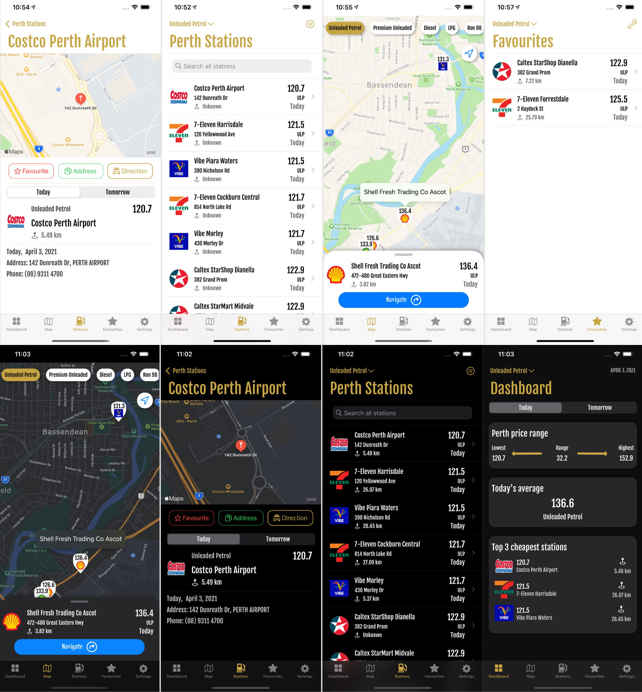

##### Fuel lens app

Youtube Link: https://youtu.be/7JW4v35if88

##### Dependencies:

- Install cocapods:

  https://guides.cocoapods.org/using/getting-started.html#toc_3

  `sudo gem install cocoapods`

- After adding a pod, instead of launch xcode project from `.xcodeproj`, it should be opened from `.xcworkspace` project else it won't build due to pod dependencies.
